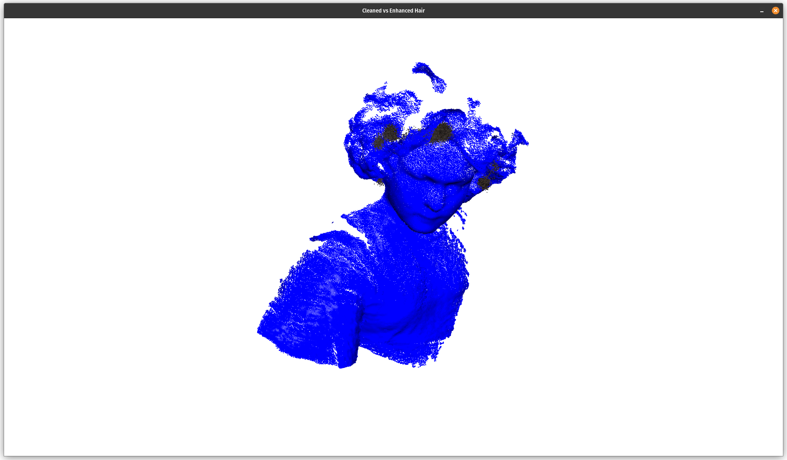

# Point Cloud Portrait Processor

This Python script processes 3D point cloud data (e.g., from PLY files) to create a photorealistic digital twin, with a focus on enhancing hair quality. It cleans the point cloud, segments the human subject and hair, refines the hair, and augments it for a natural look. The script supports both color-based and geometry-based (density/curvature) hair segmentation, making it robust for point clouds with or without color data.



## Features
- **Cleaning**: Removes background and noise using depth thresholding and statistical outlier removal.
- **Segmentation**: Isolates the human subject and hair using DBSCAN clustering and optional color-based (HSV) or geometry-based (density/curvature) methods.
- **Hair Enhancement**: Refines hair by removing noise and augments it with smoothing and densification for a natural appearance.
- **Visualization**: Displays the cleaned point cloud and enhanced hair in a single window for comparison.
- **Command-Line Interface**: Configurable via arguments for flexibility.

## Requirements
- Python 3.6+
- Libraries:
  - `open3d` (tested with 0.17.0+; CUDA support optional)
  - `numpy`
  - `opencv-python` (cv2)
  - `scikit-learn`

## Installation
1. **Install Python**: Ensure Python 3.6 or higher is installed.
2. **Install Dependencies**:
   ```bash
   pip install open3d numpy opencv-python scikit-learn
   ```
   For CUDA support (if using a GPU):
   ```bash
   pip install open3d-cuda  # Replace with the specific version matching your CUDA toolkit
   ```
3. **Clone or Download**: Place `point_cloud_portrait_processor.py` in your working directory.

## Usage
Run the script from the command line with a PLY file as input. Customize processing with optional arguments.

### Basic Example
```bash
python point_cloud_portrait_processor.py input.ply --output_file output.pcd
```
This processes `input.ply`, enhances the hair, visualizes the cleaned point cloud (blue) vs. enhanced hair (original colors or red), and saves the result to `output.pcd`.

### Advanced Example
```bash
python point_cloud_portrait_processor.py input.ply --output_file enhanced_hair.pcd --depth_threshold 2.5 --voxel_size 0.015 --smooth_radius 0.05 --densify_factor 2 --smooth_iterations 3
```
This uses custom settings for depth thresholding, downsampling, and hair augmentation.

### Command-Line Arguments
| Argument              | Type    | Default            | Description                                      |
|-----------------------|---------|--------------------|-------------------------------------------------|
| `input_file`          | str     | (required)         | Path to input PLY file                          |
| `--output_file`       | str     | `processed_portrait_hair.pcd` | Path to output PCD file             |
| `--depth_threshold`   | float   | 2.0                | Depth (Z-axis) threshold for background removal |
| `--voxel_size`        | float   | 0.01               | Voxel size for downsampling (0 to disable)      |
| `--eps_human`         | float   | 0.05               | DBSCAN `eps` for human segmentation             |
| `--min_samples_human` | int     | 10                 | DBSCAN `min_samples` for human segmentation     |
| `--eps_hair`          | float   | 0.02               | DBSCAN `eps` for hair segmentation              |
| `--min_samples_hair`  | int     | 5                  | DBSCAN `min_samples` for hair segmentation      |
| `--lower_hair`        | int x3  | `[0, 20, 20]`      | Lower HSV color range for hair (H, S, V)        |
| `--upper_hair`        | int x3  | `[30, 255, 255]`   | Upper HSV color range for hair (H, S, V)        |
| `--smooth_radius`     | float   | 0.05               | Radius for hair smoothing                       |
| `--densify_factor`    | int     | 2                  | Factor for hair densification (points added)    |
| `--smooth_iterations` | int     | 3                  | Number of smoothing iterations                  |

## Workflow
1. **Load**: Reads the PLY file into a point cloud.
2. **Clean**: Applies depth thresholding and outlier removal, with optional downsampling.
3. **Segment Human**: Uses DBSCAN to isolate the largest cluster (assumed human).
4. **Segment Hair**: Uses HSV color range (if colors exist) or density/curvature (if no colors).
5. **Refine Hair**: Removes noise from the hair point cloud.
6. **Augment Hair**: Smooths and densifies hair for a natural look.
7. **Visualize**: Shows cleaned (blue) and enhanced hair (original colors or red) in one window.
8. **Save**: Outputs the enhanced hair point cloud to a PCD file.

## Visualization
- **Cleaned Point Cloud**: Displayed in blue.
- **Enhanced Hair**: Displayed with original colors (if available) or red (if no colors).
- Use the mouse to rotate, zoom, and pan in the Open3D window.

## Potential Issues & Solutions
- **No Color Data**:
  - Falls back to density/curvature-based hair segmentation.
  - Adjust `--eps_hair`, `--min_samples_hair`, or curvature/density thresholds (in code) if hair isn’t segmented correctly.
- **Segmentation Failures**:
  - If human/hair isn’t segmented, tweak `--eps_human`, `--min_samples_human`, `--eps_hair`, or `--min_samples_hair`.
  - Example: Increase `--eps_human` to `0.1` if clusters are too small.
- **Performance**:
  - For large point clouds (e.g., 291.7k points), processing may be slow.
  - Increase `--voxel_size` (e.g., 0.02) to downsample more aggressively, but this may reduce hair detail.
- **CUDA Errors**:
  - Ensure your Open3D installation matches your CUDA version.
  - Test with CPU version (`pip install open3d`) if issues persist.

## Troubleshooting
- **No Hair Detected**:
  - Check HSV ranges (`--lower_hair`, `--upper_hair`) or adjust curvature/density percentiles in `segment_hair`.
- **Visualization Fails**:
  - Ensure Open3D is installed correctly and your system supports OpenGL.
